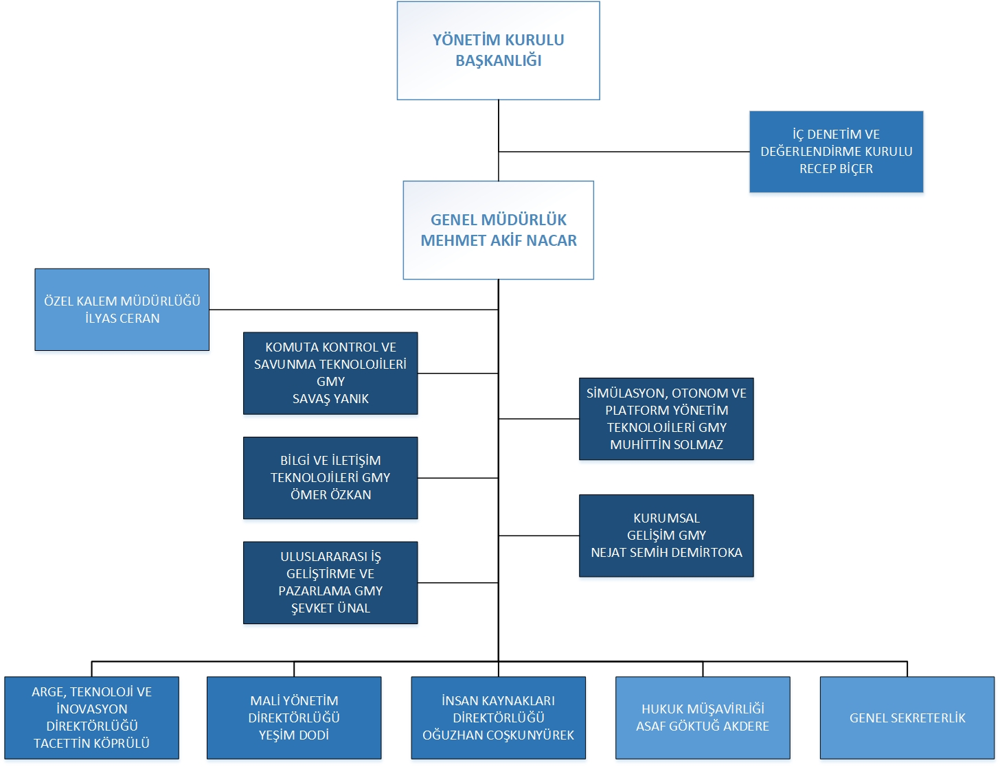

# Introduction

- I completed my internship in HAVELSAN (Havacılık ve Elektronik Sanayi A.Ş.) under the Cyber Security Directorate. HAVELSAN is a software and systems company with a business presence in the defense and IT sectors. It is headquartered in Ankara, Turkey. with subsidiary companies and offices around Turkey and abroad. Havelsan is mostly active in the fields of C4ISR, naval combat systems, E-government applications, reconnaissance surveillance and intelligence systems, management information systems, simulation and training systems, logistic support, homeland security systems, and energy management systems. 
- During the internship, I got familiar with Cybersecurity and Networking concepts and their usage throughout the company.

# 2. Company Information

## 2.1 About the Company

Havelsan was established by the [Turkish Air Force](https://en.wikipedia.org/wiki/Turkish_Air_Force "Turkish Air Force") (TUAF) Foundation in 1982 as a Turkish company named Havelsan-Aydin in order to provide maintenance for the Turkish Air Force's high technology radars.

In 1985, Havelsan was separated from the foreign shareholders and incorporated as a national company with a share of 98% owned by the Turkish Armed Forces Foundation.

In 1997, Havelsan added command control system (C4ISR), training and simulations system and management information systems to its functions. As the "Informatics and System House of Turkey" Havelsan has been designing and planning critical defense systems such as management information system, homeland security system, simulation and training system and C4ISR.

Although Havelsan has generally been involved in military software projects, it has also taken responsibilities on e-government projects and successfully implemented them.

HAVELSAN is headquartered in Ankara, Turkey. with subsidiary companies and offices around Turkey and abroad. Havelsan is mostly active in the fields of C4ISR, naval combat systems, E-government applications, reconnaissance surveillance and intelligence systems, management information systems, simulation and training systems, logistic support, homeland security systems, and energy management systems.

HAVELSAN's main stakeholders are: 
- Turkish Armed Forces Foundation (98,4875%)
- Turkish Aeronautical Association (0,50%),
- KUTLUTAŞ, İNŞAAT VE TİC.SAN.LTD.ŞTİ (0,0125%).

HAVELSAN's subsidiaries and affiliates are:
- Quantum3D Group Inc. (100%)
- HAVELSAN Technology Radar Inc. (99.98%)
- HAVELSAN Technology Oman Enterprise LLC (%70)
- Biyoteksan Biometric Recognition Technologies Inc. (50%)
- EHSIM Electronic Warfare Systems Engineering Inc. (49%)
- STM Defence Technologies Engineering Inc. (%31.90)
- Ulak Communication (%25)
- Cornea Aero Systems (20%)
- Teknohab Technology Development Zone Management Inc (13.0435%)
- ROKETSAN (4.5008%)
- PETLAS (0,001%)

## 2.2 About your department

My department Cyber Security Directorate is under the Information and Communication Technologies Assistant General Management. 
I was under the Solution Architecture Group. The solution architechture team mainly focuses on designing cybersecurity architecture of the products (could be HAVELSAN's own products as well as other state-owned enterprise system products).

### 2.2.1 Products form the department 

**HAVELSAN KALKAN**

It is a Load Balancing (LB) / Web Applicaton Firewall (WAF) product that can detect and block attacks on web applications that are at the center of cyber attack targets, and offers load balancing at the application layer for high-traffic networks. HAVELSAN KALKAN, designed to provide protection for web applications, prevents damage caused by attacks on applications and web services that cannot be detected by security solutions such as network firewalls and intrusion detection/prevention systems. HAVELSAN KALKAN performs detailed package inspection and blocks malicious requessts in line with the working principles of "Positivity Security Model" and "Signature Based (Negative Security Model)" with its Web Applications Firewall module, which is compatible with OWASP (Open Web Application Security Project) standards. It also has the ability to continously learn the behaviour of the web application (false positive learning) anf automatic whitelisting. HAVELSAN KALKAN, while ensuring the security of web applications, also works as a reverse-proxy thanks to its applicaton layer load balancing feature, and can distribute network traffic to the servers it load balancing in the most appropriate wat with selectable algorithms. HAVELSAN KALKAN, which is managed through an easy and understandable web interface, provides access to information such as processor usage/temparature, memory, disk usage from the dashboard, detailed reporting with statistical analysis data through the interface, detailed recording and instant recording tracking, SIEM (Security Information and Event Management) It offers competitive features in its field such as integration, role-based authorization, SMS/e-mail notification suport, maintenance mode for used services, interface access with two-factor authentication, customized CAPTCHA support, TLS termination and caching.

**HAVELSAN BARİYER**

HAVELSAN BARİYER is Turkey's first Data Leakage Preventation System product compatible with the PARDUS operating system, which ensures the protection of corporate data, preventing unauthorized data extraction or leaking outside the institution, ensuring information security, ensuring that the data is located where it should be and it is accessed by right users.
By defining sensitive data and security policies used within the organization, data can be tracked and audited. Thanks to its rich event record information and detailed evidence filing capabilities, evidence files are archived to the servers determined in the institution, and when an audit or forensic event is encountered, the records can be reliably examined with the documents brought from the archive. Within the scope of information security, which is a part of corporate risk management, data defined as risk is protected with BARRIER and data leakage costs that may arise are prevented.
 
## 2.3 About the hardware and software systems

## 2.4 About your supervisor

- Nezaket Atakul
- Mustafa Kemal Mahallesi Şehit Öğretmen Şenay Aybüke Yalçın Cad. No:39 P.K. : 06510 Çankaya/Ankara
- Telephone number
- e-mail
- information of education of your supervisor (university name - department - graduation year)

# 3 Work done

## 3.1 Seminars & Courses
In the first week of the internship, I've completed several courses about work health.

I also have completed several courses such as Software Testing Foundations, System Engineering Awarness Training, Crypthography, Craftmanship, Blockchain Technologies, Pardus, 5G and it's applications, Autonomous Systems, Data Science and Data Analysis, Foundations of Cyber Security, all conducted by HAVELSAN engineers.

All of the courses given to interns were on the in-house platform called HAVELSAN Academy

I also have attended to the seminars about Industrial Psychology and Collabration with HAVELSAN on graduation projects.

## 3.2 Project

# 4 Performance and Outcomes

## 4.1 Appyling Knowledge and Skills Learned at Hacettepe

Knowledge and skills that I gained from Hacettepe has made my internship process easier. I used the experience I gained from the Software Engineering course (BBM382) and Software Engineering Lab (BBM384) while developing throughout the internship. I used Version Control Systems (VCS), Software Development Life Cycle (SDLC) knowledge from the BBM382 course.

## 4.2 Solving Engineering Problems

I was able to use the concepts of software design and implementation that I learned at university 
in "solving engineering problems" at HAVELSAN.

## 4.3 Teamwork

Throughout the company, Computer Engineers, Software Engineers, Network Engineers, Electric and Electronical Engineers and Analysts work together with shared responsibilities. 

## 4.4 Multi-Disciplinary Work

As I mentioned in the Teamwork section, engineers and analysts work together in teams. In addition, meetings are held with customers (which could be HAVELSAN itself or other Government-owned companies) on projects.

## 4.5 Professional and Ethical Issues

We've informed about privacy degrees of documents we have accessed. Because HAVELSAN is a Defense company, it shares documents with organizations such as North Atlantic Treaty Organization (NATO) and Turkish Armed Forces.

## 4.6 Impact of Engineering Solutions

I learned about the solutions offered by Havelsan are used in the defense systems of countries such as Pakistan, Malaysia, Qatar and Bangladesh, especially in Turkey, in NATO missions and in infrastructures of state institutions and private companies in Turkey and their impact.

## 4.7 Locating Sources and Self-Learing

The company gave us access to its own learning platform HAVELSAN Academy, and Udemy for Business account for accessing various courses if we ever need any extra course. For the given project I also used Python docs, nmap tool docs then unix man pages for the shell applicati
ons 

## 4.8 Using New Tools and Technologies

# 5 Conclusions

I completed my 25-day long internship at HAVELSAN. I have experienced working in a defense company, and I also practiced on-site working for the first time due to pandemic. I gained know-how about cybersecurity and networking practices in a company where privacy is the most crucial aspect. 

# References

# Appendices

